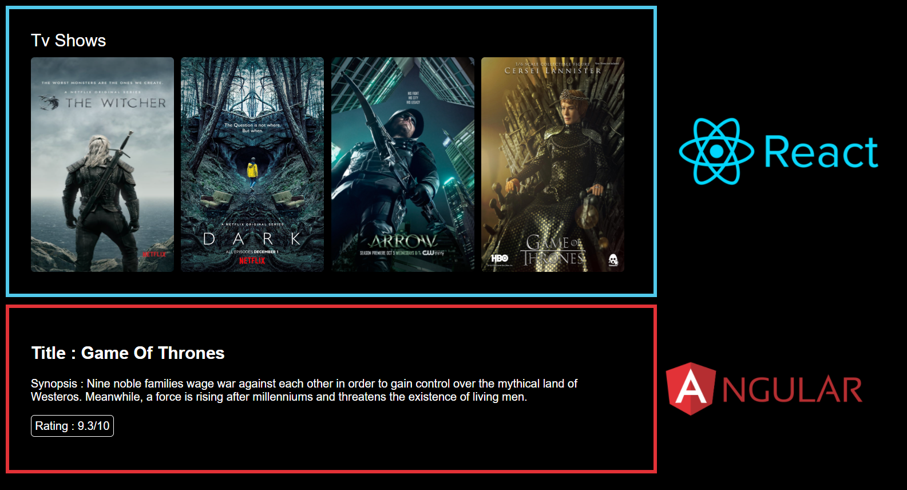

# Multi-Frontend (React + Angular)

A sample application using both react and angular to interact with each other

## Screenshots


#### Install dependencies
```bash
npm install
```

#### Run app
```bash
npm start
```

#### Open `http://localhost:9090/#/` in browser

You should see something like this:
